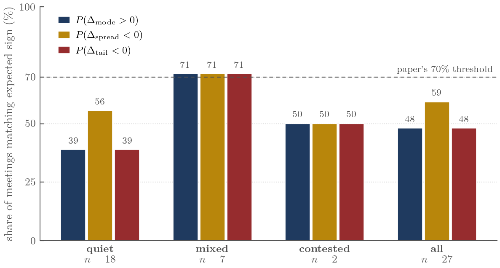

# Kalshi Regime Replication

A short replication note on **Diercks, Katz, and Wright (2026), "Kalshi and the Rise of Macro Markets"** ([FEDS 2026-010](https://doi.org/10.17016/FEDS.2026.010)).

**Headline finding:** DKW's documented disagreement between Kalshi and fed funds futures over FOMC outcomes is heavily regime-conditional. On "quiet" meetings — the bulk of the sample — every sign-match metric is at or below 50%. The 71% sign-match the paper's framing rests on emerges only in the 7-meeting "mixed" sub-sample, where it just clears the implicit 70% threshold. And the spread-gap pattern that motivates the binomial-tree critique is mechanically driven by Kalshi's wider distribution support (7 buckets vs. FedWatch's 5), not by the binomial-tree bias per se.



## Two parts

**Part 1 — Replication of DKW Table 3 Panel B.** Kalshi-side forecast accuracy numbers reproduce on a 27-meeting sample matching theirs (Sept 2022 – Dec 2025), using their own published moments file. Kalshi median and mode MAE replicate to **0.0000 exactly**; Kalshi mean MAE replicates within their two-decimal display rounding (0.0128 vs. 0.010). The FF Futures side cannot be exactly replicated from public materials — DKW's repo README states their FFR forecast uses FRB-licensed CME data not included in their release.

**Part 2 — Regime-conditional extension.** The qualitative patterns from DKW Section 5 (mode over-concentration, narrower spread, tail under-allocation) are operationalized as three sign-match metrics and conditioned on a regime classification by minimum pre-meeting Kalshi mode probability. On the same 27-meeting sample:

| Regime    | n  | $P(\Delta_{\text{mode}} > 0)$ | $P(\Delta_{\text{spread}} < 0)$ | $P(\Delta_{\text{tail}} < 0)$ |
|-----------|----|-------------------------------|---------------------------------|-------------------------------|
| Quiet     | 18 | 39%                           | 56%                             | 39%                           |
| Mixed     | 7  | 71%                           | 71%                             | 71%                           |
| Contested | 2  | 50%                           | 50%                             | 50%                           |
| **All**   | 27 | **48%**                       | **59%**                         | **48%**                       |

A robustness check on the full 37-meeting sample (9 pre-Sept-2022 + 3 early-2026 meetings added) strengthens mixed-bucket sign-match to 80% (8/10) and contested to 67% (2/3) without changing the qualitative finding.

## Repository contents

```
paper/
  paper.tex                      # the replication note (LaTeX source)
  paper.pdf                      # compiled PDF
  refs.bib                       # bibliography
  figures/                       # generated PDFs (for paper) and PNGs (for README)
code/
  extract_data.py                # pulls engine + paper distributions
                                 # from Postgres → CSV (one-time)
  analyze.py                     # regime classification + sign-match
                                 # metrics; reads CSVs in data/, writes
                                 # tables in output/
  make_figures.py                # generates the three paper figures
data/
  engine_distributions.csv       # engine-implied probabilities per
                                 # (meeting, observation_date, outcome)
  paper_distributions.csv        # mirror of paper's S3 publication
output/
  per_meeting.csv                # one row per FOMC with regime + summary
  per_day.csv                    # per (meeting, day) gap measurements
  regime_summary.json            # the headline numbers for the paper
```

## Reproducing the analysis

The two CSVs in `data/` are committed so the full analysis runs without external dependencies:

```bash
python3 -m venv .venv && source .venv/bin/activate
pip install matplotlib
make replicate    # runs analyze.py + make_figures.py
make paper        # compiles paper/paper.pdf (requires LaTeX + bibtex)
```

Or step-by-step without `make`:

```bash
python3 code/analyze.py        # writes output/{per_meeting.csv, per_day.csv, regime_summary.json}
python3 code/make_figures.py   # writes paper/figures/*.{pdf,png}

cd paper && pdflatex paper.tex && bibtex paper && pdflatex paper.tex && pdflatex paper.tex
```

To regenerate the input CSVs from a fresh source rather than the committed ones:

- `data/paper_distributions.csv` is a verbatim copy of [`daily_distributions_fed_levels.csv`](https://kalshi-and-the-rise-of-macro-markets.s3.amazonaws.com/daily_distribution_data/daily_distributions_fed_levels.csv) from the original authors' S3 bucket. Re-download with `curl -O <url>`. The columns differ slightly (we add a normalized header); see `code/extract_data.py` for the exact transformation.

- `data/engine_distributions.csv` is computed by the FedWatch-style decomposition of CME ZQ futures (linear interpolation across five 25-bp target-rate buckets, with chaining to the next non-FOMC contract month when fewer than five days remain in the contract month). The engine implementation lives in our companion repository (TODO link). With Databento access and that repository, run `code/extract_data.py` against a Postgres instance hosting our backtest predictions.

## Limitations and honest caveats

- **Sample size.** Primary sample is 27 meetings (Sept 2022 – Dec 2025), chosen to match DKW's reported sample size for like-for-like replication. Engine output for 10 additional meetings (9 pre-Sept-2022 + 3 early 2026) is used as a robustness check in Section 7.3 of the paper.
- **SOFR options not addressed.** The original paper discusses SOFR options-derived distributions separately in its Section 5 (Figure 11 and surrounding text). SOFR options carry an additional ~6 bp SOFR–EFFR spread bias and an institutional hedging-demand bias not present in fed funds futures; whether those translate into more systematic per-meeting bias than the binomial-tree-driven patterns we evaluate here is a question this note does not test.
- **Scope of replication.** We test the structural-disagreement patterns framed in DKW Section 5. We do not evaluate calibration of the implied densities against realized rates — that's a separate question, covered in the paper's Section 6.1 (Probability Integral Transform, their Figure 15).
- **Statistical robustness.** The engine implements a 5-bucket FedWatch decomposition via linear interpolation, richer than the strict 2-bucket binomial-tree decomposition the paper critiques, but still narrower than Kalshi's 7-bucket support. The spread-gap pattern emerges mechanically from this support gap regardless of bucket count, not from the binomial-tree bias per se. The 71% sign-match in mixed meetings (n=7) only just clears the 70% threshold; with such small n, the binomial 95% confidence interval is roughly 29%–96% — directionally consistent with DKW's claim but not statistically robust on its own.

## Citation

If you find this replication useful:

```bibtex
@misc{grund2026kalshi,
  author = {Oliver Grund},
  title  = {Regime-Conditional Bias in Fed Funds Futures vs Kalshi
            Distributions: A Replication Note on Diercks, Katz, and
            Wright (2026)},
  year   = {2026},
  url    = {https://github.com/t-e-lawrence/kalshi_regime_replication},
}
```

The paper being replicated:

```bibtex
@techreport{dkw2026,
  author      = {Diercks, Anthony M. and Katz, Jared Dean and Wright, Jonathan H.},
  title       = {Kalshi and the Rise of Macro Markets},
  institution = {Board of Governors of the Federal Reserve System},
  type        = {Finance and Economics Discussion Series},
  number      = {2026-010},
  year        = {2026},
  doi         = {10.17016/FEDS.2026.010},
}
```

The original authors publish replication code and data at [github.com/jdkatz21/Prediction_Markets_Public](https://github.com/jdkatz21/Prediction_Markets_Public).
